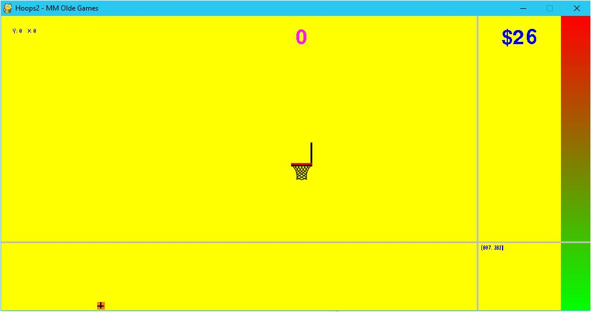

# Hoops -- Manav Malik
#### A game which involves a basketball trial for a company called NRPCA... Do your best, or fail the trial!!

## Table of Contents
- [Instructions](#instructions)
- [File Requirements](#file-requirements)
- [Module Requirements](#module-requirements)
- [Recommended Versions](#recommended-versions)
- [***Preview Image***](#preview-image) <-- Newly added! Please see!

**Read below to troubleshoot errors**

## Instructions
To play, first answer the quick questions asked of you (font, anti-lag, etc.). Then, you'll have to click to set the direction of your ball and click again on the power bar to set your power. After clicking for your power, it will automatically shoot the ball. You can receive 2 or 3 points. Once you have reached 55 points and you took about only 2 shots to make it in each time, you can click randomly to end the trial (or wait until you miss 5 times), at which point the screen will either flash red or green depending on whether you made the trial or not. Some text will show up with more details...

**Important:** Press "s" when in between shots to see the settings menu. You can change your theme if you get enough coins!

Happy playing!

## File Requirements
All files that are **necessary** are in the GitHub repository. Be sure to download **all** files or risk the game crashing. Be sure that editing permissions are enabled on all files, or the game may crash once more.

## Module Requirements
All of these are **necessary**!
- PyGame
- time
- random

You *may* need to open the `.py` file in the Python IDE in order to correctly run PyGame...

**Note:** Some of these come included in Python (time and random)! You will need to download PyGame if you don't already have it.

## Recommended Versions
- Python 3.4/3.5
- PyGame 1.9
- Windows 8 and above (though anything else will work fine)

## Preview Image

(Here, you can see the user is in the process of setting the direction of the ball/where it will go...)
